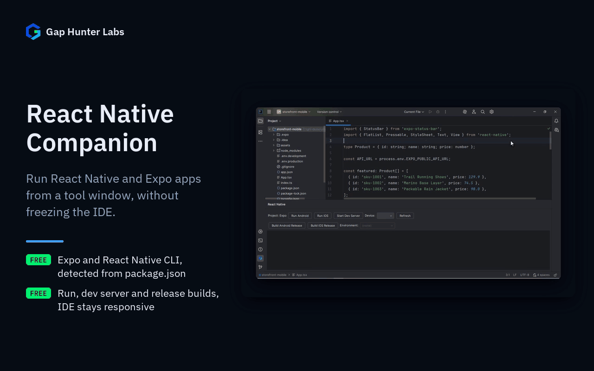

# React Native Companion

IntelliJ/WebStorm/PhpStorm plugin. Run React Native and Expo apps (run on
Android/iOS, dev server, release builds) from a tool window without
freezing the IDE.



Each feature on its own:
[Start the dev server](docs/media/01-dev-server.gif) ·
[No IDE freeze](docs/media/02-keeps-editing.gif)

## Why it exists

Born from real evidence in JetBrains Marketplace reviews, not
assumptions: the leading paid alternative in this space (React Native
Console, ~430K downloads, $19-24/year) has a recent, severe, reproducible
complaint — "severely impacting IDE performance... frequently becomes
unresponsive... thread dumps are required" — plus older reports of buggy
iOS simulator integration and unreliable buttons. The same vendor's own
free tier is rated higher than their paid one, suggesting the problem is
implementation quality in the paid tier's extra features, not something
inherent to the feature set.

## Why built this way

IntelliJ's platform already ships `OSProcessHandler`, an async process
API that reads a spawned process's I/O on background threads by
construction. Using it (instead of e.g. blocking `Runtime.exec().waitFor()`
calls on the UI thread) isn't an optimization here — it's the direct fix
for the incumbent's #1 complaint. Same for the device/simulator picker:
it parses the real, unmodified output of `adb devices` and
`xcrun simctl list devices` rather than wrapping some other layer that
could itself introduce bugs.

**Expo, not only the React Native CLI.** React Native's own getting-started
page recommends a framework -- Expo -- for new apps, and in the npm
registry `expo` is downloaded almost three times as often as
`@react-native-community/cli` (6.86M vs 2.42M a week, 2026-09-14..20). In
an Expo project the commands are `expo run:android` / `run:ios` / `start`,
not `react-native run-*`, so the toolchain is detected from
`package.json` and every button builds the right command
(`CommandPlan`, unit-tested). JetBrains's own React Native run
configuration targets the React Native CLI only.

## Usage

Open the **React Native** tool window (bottom of the IDE). The first line
shows which toolchain was detected (**React Native CLI** or **Expo**).

- **Run Android** / **Run iOS** / **Start Dev Server** run the app, on the
  device picked in **Device** (Android devices from `adb devices`, iOS
  simulators from `xcrun simctl`). A device only applies to its own
  platform. **Refresh** re-reads devices, `.env*` files and the toolchain.
- **Build Android Release** / **Build iOS Release**: `react-native
  build-android --mode=release` / `build-ios --mode=Release`, or, in an
  Expo project, the local release builds `expo run:android --variant
  release` / `expo run:ios --configuration Release` (no EAS account
  involved).
- **Environment** (React Native CLI projects): picks one of the `.env*`
  files at the project root and sets `ENVFILE` for every command -- the
  convention `react-native-config` reads. Expo loads `.env*` files itself,
  so the dropdown is disabled there.

Exact flags, from each CLI's own docs: React Native CLI `run-android
--deviceId <adb serial>` (documented as deprecated in favour of `--device
<name>`, but it's the flag that takes the serial `adb devices` prints, and
older CLIs understand it too) and `run-ios --udid <udid>`; Expo `--device
<id>`. Arguments are passed as a list, never through a shell, so simulator
names with spaces are safe.

## Support

- **Bugs and feature requests:** [GitHub Issues](https://github.com/GapHunterLabs/react-native-companion/issues)
- **Questions, or custom rules for a team's codebase:** **gaphunterlabs@gmail.com**
- **Security vulnerabilities:** report privately as described in [SECURITY.md](SECURITY.md), not in a public issue.
- **Privacy and network behavior:** [PRIVACY.md](PRIVACY.md)

## Development

```
./gradlew test           # unit tests
./gradlew buildPlugin     # generates build/distributions/*.zip
./gradlew verifyPlugin    # checks compatibility against real IDEs
```

## License

Apache-2.0. See `LICENSE`.
